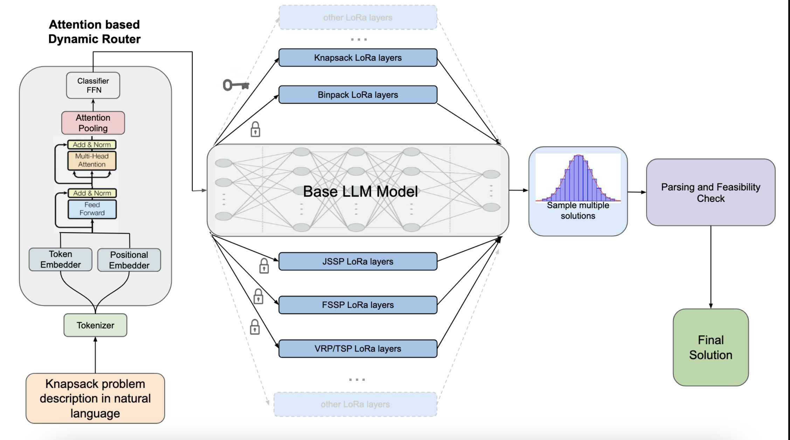

# ACCORD: Autoregressive Constraint-satisfying Generation for COmbinatorial Optimization with Routing and Dynamic attention 



This repository contains code for training and running inference with language models on combinatorial optimization problems using the ACCORD dataset. The models are fine-tuned to solve various optimization problems including Vehicle Routing, Traveling Salesman, Knapsack, Bin Packing, Job Shop Scheduling, and Flow Shop Scheduling.

## Dataset

<div align="center">
  <a href="https://huggingface.co/datasets/henri24/ACCORD">
    
  </a>
</div>

The training and validation data comes from the [ACCORD dataset](https://huggingface.co/datasets/mideavalwisard/ACCORD).

**Important:** The folder structure for the dataset must exactly match what's in the Hugging Face repository. When you download the dataset, ensure that the files are organized in the same hierarchy as in the original dataset repository.

## Installation

You can install all required dependencies using the provided requirements.txt file:

```bash
pip install -r requirements.txt
```

Or install individual packages:

```bash
pip install unsloth torch datasets transformers numpy pandas matplotlib seaborn tqdm
```

## Dataset Setup

1. Download the ACCORD dataset from Hugging Face
2. Place the data in your project directory, maintaining the following structure:

```
.
├── train_data/
│   ├── vrp_tsp_train_data/
│   ├── knapsack_train_data/
│   ├── binpack_train_data/
│   ├── jssp_train_data/
│   └── fssp_train_data/
├── validation_data/
│   ├── vrp_val_data.json
│   ├── tsp_val_data.json
│   ├── knapsak_val_data.json
│   ├── binpack_val_data.json
│   ├── jssp_val_data.json
│   └── fssp_val_data.json
```

## Training

Use the `unified_trainer.py` script to train models on different optimization problems. The script supports various configuration options:

### Basic Training Example

```bash
python unified_trainer.py \
  --model_type llama8b \
  --dtype bfloat16 \
  --load_in_4bit \
  --lora_r 64 \
  --lora_alpha 64 \
  --per_device_train_batch_size 8 \
  --gradient_accumulation_steps 4 \
  --num_train_epochs 2 \
  --learning_rate 2e-4 \
  --train_vrp_tsp \
  --output_accord
```

### Key Parameters

- `--model_type`: Choose between `llama8b` (8B parameter model) or `llama1b` (1B parameter model)
- `--output_accord`: Use ACCORD style output format
- `--output_list_of_lists`: Use list of lists output format
- Problem type flags (pick one):
  - `--train_vrp_tsp`: Train on Vehicle Routing / TSP problems
  - `--train_knapsack`: Train on Knapsack problems
  - `--train_binpack`: Train on Bin Packing problems
  - `--train_jssp`: Train on Job Shop Scheduling problems
  - `--train_fssp`: Train on Flow Shop Scheduling problems

## Inference

The repository includes three inference scripts for different problem types:

### 1. Vehicle Routing & TSP Inference

```bash
python inference_vrp_tsp.py \
  --max_seq_length 40000 \
  --max_attempts 6 \
  --num_return_sequences 10 \
  --output_accord \
  --use_distance
```

### 2. Knapsack & Bin Packing Inference

```bash
python inference_knapsack_binpack.py \
  --max_seq_length 40000 \
  --max_attempts 6 \
  --num_return_sequences 10 \
  --output_accord \
  --infer_binpack  # Remove for knapsack
```

### 3. Job Shop & Flow Shop Scheduling Inference

```bash
python inference_jssp_fssp.py \
  --max_seq_length 40000 \
  --max_attempts 6 \
  --num_return_sequences 10 \
  --output_accord \
  --infer_fssp  # Remove for JSSP
```

### Key Inference Parameters

- `--max_attempts`: Number of generation attempts per problem
- `--num_return_sequences`: Number of sequences to generate per attempt
- `--output_accord` / `--output_list_of_lists`: Specify the output format
- `--model_1B`: Use the 1B parameter model instead of the default 8B model
- `--use_distance`: Include distance matrix in the input (for VRP/TSP)

## Output Formats

The models support two output formats:

1. **ACCORD Format**: Detailed solution following the ACCORD dataset format
2. **List of Lists Format**: Simplified solution with just the index routes

## Model Directory Structure

After training, models will be saved to:

```
finetuned_models/
├── vrp_tsp_models/
│   ├── llama1B/
│   │   ├── accord/
│   │   └── list_of_lists/
│   └── llama8B/
│       ├── accord/
│       └── list_of_lists/
├── knapsack_models/
└── ...
```

## Validation Results

Inference results will be saved to:

```
val_results/
├── vrp_val/
├── knapsack_val/
└── ...
```

